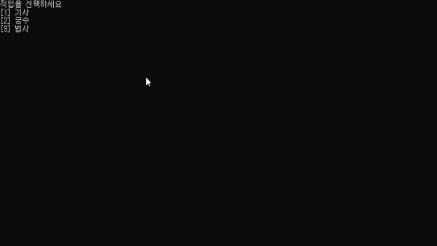

# C#과 유니티를 위한 게임 프로그래밍

C#을 활용한 유니티 엔진을 다루기 위한 기본적인 게임프로그래밍 프로젝트입니다.  
[visual studio](https://visualstudio.microsoft.com/ko/) 와 [unity](https://unity.com/kr) 를 활용하여 프로젝트를 시작합니다.

## 🖥️ 동작 화면

### `01_text-rpg`

### `02_Maze Algorithm`

## 🎯Main Contents

- 코드 흐름 제어를 사용한 논리적 설계
- `객체지향`을 통한 코드 리팩토링
- `자료구조`를 활용한 맵 생성
- `알고리즘`을 활용한 미로 생성 및 길찾기

## Reference

- Mazes for Programmers: Code Your Own Twisty Little Passages
